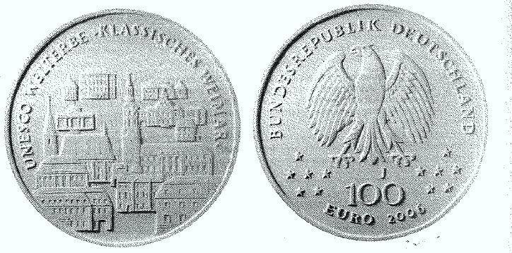

# Bekanntmachung über die Ausprägung von deutschen Euro-Gedenkmünzen im  Nennwert von 100 Euro (Goldmünze "UNESCO Welterbe – Klassisches Weimar") (Münz100EuroBek 2006)

Ausfertigungsdatum
:   2006-08-28

Fundstelle
:   BGBl I: 2006, 2118

## (XXXX)

Gemäß den §§ 2, 4 und 5 des Münzgesetzes vom 16. Dezember 1999 (BGBl.
I S. 2402) hat die Bundesregierung beschlossen, zum Thema "UNESCO
Welterbe - Klassisches Weimar" eine Gedenkmünze zu 100 Euro aus Gold
prägen zu lassen.

Die Auflage der Münze beträgt 350.000 Stück. Die Münze wird zu
gleichen Teilen in den Münzstätten Berlin (Münzzeichen "A"), München
(Münzzeichen "D"), Stuttgart (Münzzeichen "F"), Karlsruhe (Münzzeichen
"G") und Hamburg (Münzzeichen "J") in Stempelglanzausführung geprägt.

Die Münze wird ab dem 2. Oktober 2006 in den Verkehr gebracht. Sie
besteht aus Gold mit einem Feingehalt von 999,9 Tausendteilen
(Feingold). Sie hat einen Durchmesser von 28 Millimetern und eine
Masse (Gewicht) von 15,55 Gramm. Der Münzrand ist geriffelt.

Die Bildseite greift das Thema "UNESCO Welterbe - Klassisches Weimar"
durch die Auswahl verschiedener charakteristischer Architekturelemente
auf. Dabei wird das bürgerliche dem fürstlichen Weimar, das
intellektuelle dem residenziellen gegenübergestellt. Auf originelle
und überzeugende Weise gelingt es dem Künstler, den Betrachter auch
durch die starke perspektivische Tiefe in den Gesamtzusammenhang des
klassischen Weimar hineinzuziehen.

Die Wertseite zeigt einen Adler, den Schriftzug "BUNDESREPUBLIK
DEUTSCHLAND", die zwölf Europasterne, die Wertziffer mit der Euro-
Bezeichnung sowie die Jahreszahl "2006" und - je nach Münzstätte - das
Münzzeichen "A", "D", "F", "G" oder "J".

Der Entwurf der Münze stammt von Herrn Dietrich Dorfstecher, Berlin.

## Schlussformel

Der Bundesminister der Finanzen

## (XXXX)

(Fundstelle: BGBl. I 2006, 2118)

