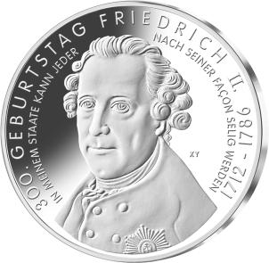
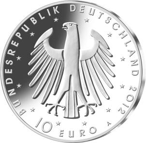

# Bekanntmachung über die Ausprägung von deutschen Euro-Gedenkmünzen im Nennwert von 10 Euro (Gedenkmünze „300. Geburtstag Friedrich II.“) (Münz10EuroBek 2011-12-13)

Ausfertigungsdatum
:   2011-12-13

Fundstelle
:   BGBl I: 2011, 2797

## (XXXX)

Gemäß den §§ 2, 4 und 5 des Münzgesetzes vom 16. Dezember 1999 (BGBl.
I S. 2404) hat die Bundesregierung beschlossen, zum Thema „300.
Geburtstag Friedrich II.“ eine deutsche Euro-Gedenkmünze im Nennwert
von 10 Euro prägen zu lassen.

Die Auflage der Münze beträgt ca. 2 000 000 Stück, davon ca. 300 000
Stück in der Spiegelglanzqualität. Die Prägung erfolgt durch die
Staatliche Münze Berlin.

Die Münze wird ab dem 9. Februar 2012 in den Verkehr gebracht. Die 10
-Euro-Gedenkmünze in der Stempelglanzqualität besteht aus einer
Kupfer-Nickel-Legierung (CuNi25), hat einen Durchmesser von 32,5
Millimetern und eine Masse von 14 Gramm. Die Spiegelglanzmünze besteht
aus einer Legierung von 625 Tausendteilen Silber und 375 Tausendteilen
Kupfer, hat einen Durchmesser von 32,5 Millimetern und ein Gewicht von
16 Gramm. Die Spiegelglanzmünze ist durch den Prägeaufdruck „SILBER
625“ gekennzeichnet. Das Gepräge auf beiden Seiten ist erhaben und
wird von einem schützenden, glatten Randstab umgeben.

Die Bildseite der Münze zeigt das Porträt des
46-jährigen              Friedrichs des Großen, das mit einem
programmatischen Zitat des Königs sowie einer Umschrift anlässlich des
Jubiläums umrahmt ist.

Die Wertseite zeigt einen Adler, die Umschrift „BUNDESREPUBLIK
DEUTSCHLAND 2012“ mit den zwölf Europasternen und der Wertbezeichnung
„10 Euro“ sowie dem Münzzeichen „A“ der Staatlichen Münze Berlin. Auf
der Wertseite der Münze in Spiegelglanzqualität ist zusätzlich die
Angabe „SILBER 625“ aufgeprägt.

Der glatte Münzrand enthält in vertiefter Prägung die Inschrift:

„\*MICH MEINEN MITBÜRGERN NÜTZLICH ERWEISEN\*“.

Der Entwurf der Münze stammt von dem Künstler Erich Ott aus München.

## Schlussformel

Der Bundesminister der Finanzen

## (XXXX)

*    *        
    *        

*    *        
    *        

