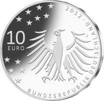
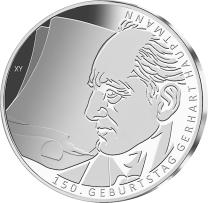
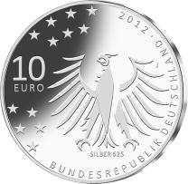

# Bekanntmachung über die Ausprägung von deutschen Euro-Gedenkmünzen im Nennwert von 10 Euro (Gedenkmünze „150. Geburtstag Gerhart Hauptmann“) (Münz10EuroBek 2012-11-19)

Ausfertigungsdatum
:   2012-11-19

Fundstelle
:   BGBl I: 2012, 2460

## (XXXX)

Gemäß den §§ 2, 4 und 5 des Münzgesetzes vom 16. Dezember 1999 (BGBl.
I S. 2402) hat die Bundesregierung beschlossen, zum Thema „150.
Geburtstag Gerhart Hauptmann“ eine deutsche Euro-Gedenkmünze im
Nennwert von 10 Euro prägen zu lassen.

Die Auflage der Münze beträgt ca. 1 700 000 Stück, davon ca. 200 000
Stück in Spiegelglanzqualität. Die Prägung erfolgt durch die
Hamburgische Münze (Prägezeichen J).

Die Münze wird ab dem 8. November 2012 in den Verkehr gebracht. Die 10
-Euro-Gedenkmünze in der Stempelglanzqualität besteht aus einer
Kupfer-Nickel-Legierung (CuNi25), hat einen Durchmesser von 32,5
Millimetern und eine Masse von 14 Gramm. Die Spiegelglanzmünze besteht
aus einer Legierung von 625 Tausendteilen Silber und 375 Tausendteilen
Kupfer, hat einen Durchmesser von 32,5 Millimetern und ein Gewicht von
16 Gramm. Das Gepräge auf beiden Seiten ist erhaben und wird von einem
schützenden, glatten Randstab umgeben.

Die Bildseite zeigt ein Profil Gerhart Hauptmanns sowie einen großen
Papierbogen und eine Schreibfeder, die die produktive Tätigkeit des
Dichters symbolisieren.

Die Wertseite zeigt einen Adler, den Schriftzug „BUNDESREPUBLIK
DEUTSCHLAND“, Wertziffer und Wertbezeichnung, das Prägezeichen „J“ der
Hamburgischen Münze, die Jahreszahl 2012 sowie die zwölf Europasterne.
Auf der Wertseite der Münze in Spiegelglanzqualität ist zusätzlich die
Angabe „SILBER 625“ aufgeprägt.

Der glatte Münzrand enthält in vertiefter Prägung die Inschrift:

„*              A JEDER MENSCH
HAT HALT `NE SEHNSUCHT*             “.

Der Entwurf stammt von dem Künstler Jordi Truxa aus Berlin.

## Schlussformel

Der Bundesminister der Finanzen

## (XXXX)

(Fundstelle: BGBl. I 2012, 2460)

*    *        
    *        

*    *        
    *        

