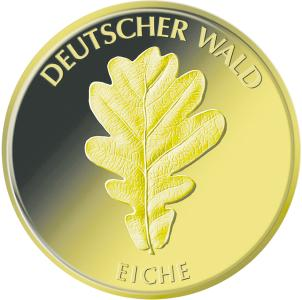
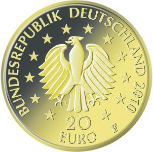

# Bekanntmachung über die Ausprägung von deutschen Euro-Gedenkmünzen im Nennwert von 20 Euro (Goldmünze „Eiche“ der Serie „Deutscher Wald“) (Münz20EuroBek 2010)

Ausfertigungsdatum
:   2010-04-30

Fundstelle
:   BGBl I: 2010, 609

## (XXXX)

Gemäß den §§ 2, 4 und 5 des Münzgesetzes vom 16. Dezember 1999 (BGBl.
I S. 2402) hat die Bundesregierung beschlossen, in den Jahren 2010 bis
2015 eine Serie von Kleinen Goldmünzen im Nominalwert von 20 Euro
prägen zu lassen, die dem deutschen Wald gewidmet werden und die sich
im Kontext mit dem Internationalen Jahr der Wälder 2011 (UN-Resolution
61/193 vom 20. Dezember 2006) befindet. Die Serie beginnt mit der
Münze „Eiche“.

Die limitierte Auflage der 20-Euro-Goldmünze „Eiche“ beträgt 200 000
Stück. Die Münze wird zu gleichen Teilen in den Münzstätten Berlin
(Münzzeichen „A“), München (Münzzeichen „D“), Stuttgart (Münzzeichen
„F“), Karlsruhe (Münzzeichen „G“) und Hamburg (Münzzeichen „J“) in
Stempelglanzausführung geprägt.

Die Münze wird ab dem 23. Juni 2010 in den Verkehr gebracht. Sie
besteht aus Gold mit einem Feingehalt von 999,9 Tausendteilen
(Feingold). Sie hat einen Durchmesser von 17,5 Millimeter und eine
Masse (Gewicht) von 3,89 Gramm beziehungsweise 1/8 Unze. Der Münzrand
ist geriffelt.

Der Entwurf der Bildseite der Münze stammt von dem Künstler Heinz
Hoyer aus Berlin.

Die Wertseite der Münze wurde von dem Künstler Frantisek Chochola aus
Hamburg entworfen.

Die Wertseite zeigt einen Adler, den Schriftzug „BUNDESREPUBLIK
DEUTSCHLAND“, die zwölf Europasterne, die Wertziffer mit der Euro-
Bezeichnung sowie die Jahreszahl „2010“ und – je nach Münzstätte – das
Münzzeichen „A“, „D“, „F“, „G“ oder „J“.

## Schlussformel

Der Bundesminister der Finanzen

## (XXXX)

(Fundstelle: BGBl. I 2010, 609)

*    *        
    *        

