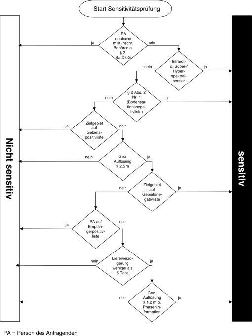

# Verordnung zum Satellitendatensicherheitsgesetz (SatDSiV)

Ausfertigungsdatum
:   2008-03-26

Fundstelle
:   BGBl I: 2008, 508

## Eingangsformel

Auf Grund des § 2 Abs. 2 des Satellitendatensicherheitsgesetzes vom
23\. November 2007 (BGBl. I S. 2590) und auf Grund des § 17 Abs. 3 Satz
1 des Satellitendatensicherheitsgesetzes im Einvernehmen mit dem
Auswärtigen Amt, dem Bundesministerium des Innern und dem
Bundesministerium der Verteidigung verordnet das Bundesministerium für
Wirtschaft und Technologie:

## § 1 Daten mit besonders hohem Informationsgehalt

(1) Ein Sensor eines Erdfernerkundungssystems ist alleine oder in
Kombination mit einem oder mehreren Sensoren technisch in der Lage,
Daten mit besonders hohem Informationsgehalt zu erzeugen, wenn in
mindestens einer Raumrichtung eine geometrische Auflösung von 2,5
Metern oder weniger erzeugt werden kann.

(2) Ein besonders hoher Informationsgehalt ist auch gegeben, wenn

1.  im Spektralbereich von 8 bis 12 Mikrometern (thermisches Infrarot) in
    mindestens einer Raumrichtung eine geometrische Auflösung von 5 Metern
    oder weniger erzeugt werden kann,

2.  im Spektralbereich zwischen 1 Millimeter und 1 Meter (Mikrowellen) in
    mindestens einer Raumrichtung eine geometrische Auflösung von 3 Metern
    oder weniger erzeugt werden kann oder

3.  die Zahl der Spektralkanäle 49 übersteigt (super- und hyperspektrale
    Sensoren) und in mindestens einer Raumrichtung eine geometrische
    Auflösung von 10 Metern oder weniger erzeugt werden kann.

## § 2 Sensitive Anfragen

(1) Eine Anfrage der Bundesrepublik Deutschland nach § 21 des
Satellitendatensicherheitsgesetzes oder einer deutschen militärischen
oder nachrichtendienstlichen Behörde ist nicht sensitiv.

(2) Im Übrigen ist eine Anfrage sensitiv, wenn

1.  die Daten an ein Bodensegment übermittelt werden sollen, das nicht von
    der NATO, der Europäischen Union, einem Mitgliedstaat der NATO oder
    der Europäischen Union, Australien, Japan, Neuseeland oder der Schweiz
    betrieben wird und sich auf dem Staatsgebiet eines Landes befindet,
    das in Anlage 1 aufgeführt ist, oder

2.  das dargestellte Zielgebiet nicht in Anlage 2 aufgeführt ist, die
    Daten in mindestens einer Raumrichtung eine geometrische Auflösung von
    2,5 Metern oder weniger haben und

    a)  das dargestellte Zielgebiet in Anlage 3 aufgeführt ist, oder

    b)  die Person des Anfragenden nicht in Anlage 4 aufgeführt ist, der
        Zeitraum zwischen der Erzeugung der Daten und der Bedienung der
        Anfrage weniger als fünf Tage beträgt und

        aa) die Daten in mindestens einer Raumrichtung eine geometrische Auflösung
            von 1,2 Metern oder weniger haben oder

        bb) sich aus den Daten (neben der Radarintensität auch) Phaseninformation
            rekonstruieren lässt

    oder

3.  Daten im Spektralbereich von 8 bis 12 Mikrometern (thermisches
    Infrarot) oder mit einem super- oder hyperspektralen Sensor erzeugt
    werden.

(3) Der Prüfablauf zur Bestimmung sensitiver Anfragen nach Absatz 1
und 2 ist in Anlage 5 als Abfolge der Entscheidungsschritte in einem
Flussdiagramm dargestellt.

## § 3 Inkrafttreten

Die Verordnung tritt am Tag nach der Verkündung in Kraft.

(zu § 2 Abs. 2 Nr. 1)

## Anlage 1 Bodenstationsnegativliste

( Fundstelle: BGBl. I 2008, 509 )
Staatsgebiet Armenien
Staatsgebiet Aserbaidschan
Staatsgebiet Côte d´Ivoire
Staatsgebiet Demokratische Volksrepublik Korea (Nordkorea)
Staatsgebiet Irak
Staatsgebiet Islamische Republik Iran
Staatsgebiet Kongo
Staatsgebiet Kuba
Staatsgebiet Libanon
Staatsgebiet Liberia
Staatsgebiet Republik Moldau
Staatsgebiet Myanmar
Staatsgebiet Ruanda
Staatsgebiet Sierra Leone
Staatsgebiet Simbabwe
Staatsgebiet Somalia
Staatsgebiet Sudan
Staatsgebiet Arabische Republik Syrien
Staatsgebiet Turkmenistan
Staatsgebiet Usbekistan
Staatsgebiet Weißrussland

(zu § 2 Abs. 2 Nr. 2)

## Anlage 2 Gebietspositivliste

( Fundstelle: BGBl. I 2008, 509 )
Antarktischer Kontinent und angrenzende Meere (alle Gebiete südlich
von –60° geographischer Breite)

Nordpolarer Teil der Arktis (alle Gebiete nördlich von 84°
geographischer Breite)

(zu § 2 Abs. 2 Nr. 2 Buchstabe a)

## Anlage 3 Gebietsnegativliste

( Fundstelle: BGBl. I 2008, 509 )
Staatsgebiet Afghanistan
Staatsgebiet Armenien
Staatsgebiet Aserbaidschan
Staatsgebiet Äthiopien
Staatsgebiet Bahrain
Staatsgebiet Bosnien-Herzegowina
Staatsgebiet Dschibuti
Staatsgebiet Eritrea
Staatsgebiet Georgien
Staatsgebiet Irak
Staatsgebiet Israel und palästinensische Autonomiegebiete
Staatsgebiet Kongo
Kosovo/UNMIK (VN-Resolution 1244 (1999))
Staatsgebiet Libanon
Staatsgebiet Republik Moldau
Staatsgebiet Somalia
Staatsgebiet Sudan
Staatsgebiet Tschad
Staatsgebiet Usbekistan
Westsahara

(zu § 2 Abs. 2 Nr. 2 Buchstabe b)

## Anlage 4 Empfängerpositivliste

( Fundstelle: BGBl. I 2008, 510 )

1.  Sicherheitsbehörden (militärische, nachrichtendienstliche,
    polizeiliche) der NATO, der Europäischen Union oder eines ihrer
    Mitgliedstaaten auf nationaler Ebene.

2.  Sicherheitsbehörden (militärische, nachrichtendienstliche,
    polizeiliche) von Australien, Japan, Neuseeland oder der Schweiz auf
    nationaler Ebene.

3.  Personen,

    a)  die von einer Sicherheitsbehörde nach Nummer 1 oder 2 durch Erklärung
        gegenüber dem Datenanbieter ermächtigt sind, Daten in deren Auftrag
        anzufragen,

    b)  deren Ermächtigung nach Buchstabe a vom Datenanbieter gegenüber dem
        Bundesamt für Wirtschaft und Ausfuhrkontrolle angezeigt worden ist,

    c)  die zusichern, die Datenanfrage innerhalb des Auftrags der jeweiligen
        Sicherheitsbehörde zu stellen und die Daten oder die aus ihnen
        abgeleiteten Dienstleistungen ausschließlich zur Weitergabe an die
        jeweilige Sicherheitsbehörde zu nutzen, und

    d)  bei denen dem Datenanbieter keine tatsächlichen Anhaltspunkte für
        begangene oder bevorstehende Verstöße gegen ihre Zusicherung nach
        Buchstabe c vorliegen.

(zu § 2 Abs. 1 und 2)

## Anlage 5 Übersicht über den Prüfablauf

( Fundstelle: BGBl. I 2008, 511 )

