# Bekanntmachung zu § 4 des Warenzeichengesetzes (WZG§4NLDBek 1972)

Ausfertigungsdatum
:   1972-05-18

Fundstelle
:   BGBl I: 1972, 1203

## (XXXX)

(1) Auf Grund des § 4 Abs. 2 Nr. 3 des Warenzeichengesetzes in der
Fassung der Bekanntmachung vom 2. Januar 1968 (Bundesgesetzbl. I S. 1,
29), zuletzt geändert durch Gesetz vom 23. Juni 1970 (Bundesgesetzbl.
I S. 805), werden in der Anlage amtliche Prüf- und Gewährzeichen
bekanntgemacht, die im Königreich der Niederlande für Käse eingeführt
sind.

(2)
Diese Bekanntmachung tritt an die Stelle der Bekanntmachung vom 17.
Mai 1967 (Bundesgesetzbl. I S. 574).              Sie ergeht im
Anschluß an die Bekanntmachung vom 9. März 1972 (Bundesgesetzbl. I S.
455).

## Schlussformel

Der Bundesminister der Justiz

## Anlage

(Fundstelle: BGBl. I 1972, 1204 - 1207)
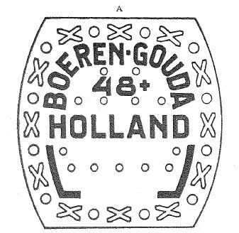
A:  bestimmt für Gouda-Bauernkäse nach Artikel 12 der
    Käsekontrollverordnung 1970

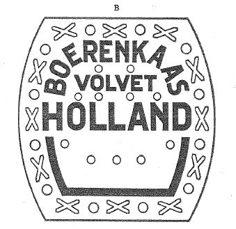
B:  bestimmt für Baby-Gouda-Bauernkäse nach Artikel 13 der
    Käsekontrollverordnung 1970

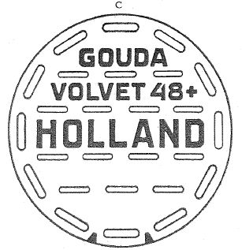
C:  bestimmt für Gouda-Käse nach Artikel 22 und Gouda-Käse ohne Rinde nach
    Artikel 23 der Käsekontrollverordnung 1970

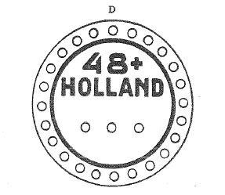
D:  bestimmt für Baby-Gouda-Käse nach Artikel 24 der
    Käsekontrollverordnung 1970

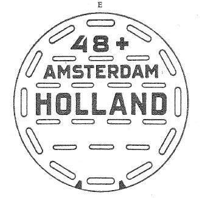
E:  bestimmt für Amsterdamer Käse nach Artikel 25 der
    Käsekontrollverordnung 1970

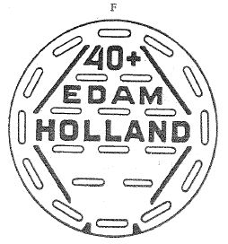
*    *   F:

    *   bestimmt für:

    *

*    *
    *   Edamer Käse

    *   nach Artikel 26

*    *
    *   Block-Edamer-Käse

    *   nach Artikel 27

*    *
    *   Edamer Käse ohne Rinde

    *   nach Artikel 28
        der Käsekontrollverordnung 1970

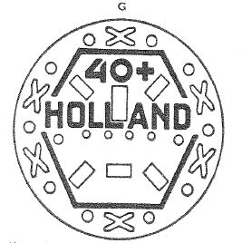
*    *   G:

    *   bestimmt für:

    *

*    *
    *   Edamer Käse in kleiner Brotform

    *   nach Artikel 29

*    *
    *   Edamer Käse in großer Brotform

    *   nach Artikel 30

*    *
    *   Baby-Edamerkäse

    *   nach Artikel 31

*    *
    *   Doppelkugelkäse (“Commissiekaas)

    *   nach Artikel 32

*    *
    *   großer Kugelkäse (“Middelbare kaas”)

    *   nach Artikel 33

*    *
    *   Leidener Käse 40
        +

    *   nach Artikel 34

*    *
    *   Gewürznelken-und Kanterkäse 40
        +

    *   nach Artikel 35 der Käsekontrollverordnung 1970

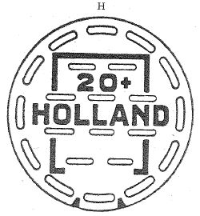
H:  bestimmt für: Leidener Käse 20
    +                    nach Artikel 36 und Gewürznelken- und Kanterkäse
    20
    +                    nach Artikel 37 der Käsekontrollverordnung 1970

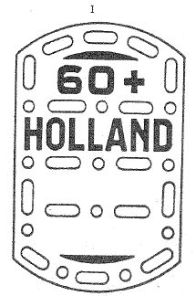
I:  bestimmt für großen Rahmkäse nach Artikel 38 der
    Käsekontrollverordnung 1970

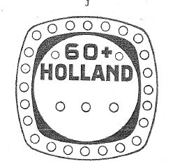
J:  bestimmt für kleinen Rahmkäse nach Artikel 39 der
    Käsekontrollverordnung 1970

K:  bestimmt für Cheddarkäse nach Artikel 40 der Käsekontrollverordnung
    1970

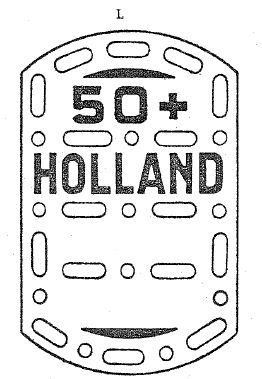
L:  bestimmt für Käse nach Artikel 41 Abs. 2 und einen blauen Schimmelkäse
    nach Artikel 42 der Käsekontrollverordnung 1970

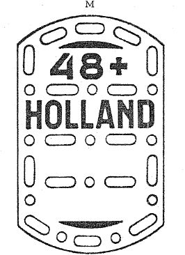
M:  bestimmt für Käse nach Artikel 43 und Meshanger Käse nach Artikel 44
    der Käsekontrollverordnung 1970

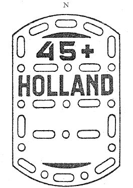
N:  bestimmt für Käse nach Artikel 41 Abs. 1 und Tilsiter Käse nach
    Artikel 45 der Käsekontrollverordnung 1970

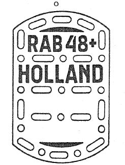
O:  bestimmt für nassen “rabbinalen” Käse oder weißen Maikäse nach Artikel
    14 und 46 der Käsekontrollverordnung 1970

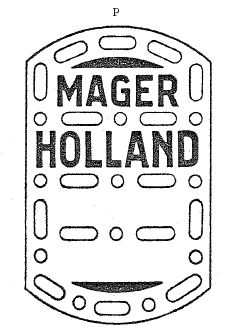
P:  bestimmt für Mager-Käse nach Artikel 47 der Käsekontrollverordnung
    1970

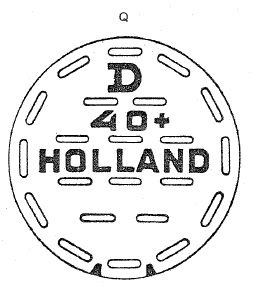
Q:  bestimmt für Diätkäse nach Artikel 13 und 48 der
    Käsekontrollverordnung 1970 mit der Maßgabe, daß das abgebildete
    Zeichen ausschließlich für Diätkäse mit einem Fettgehalt von
    mindestens 40 % in der Trockenmasse bestimmt ist und daß für Diätkäse
    mit einem Fettgehalt von höchstens 4 %, mindestens 20 % oder
    mindestens 48 % jeweils an Stelle der Bezeichnung “40
    +                   ” die Bezeichnungen “mager”, “20
    +                   ” oder “48
    +                   ” verwendet werden müssen.

